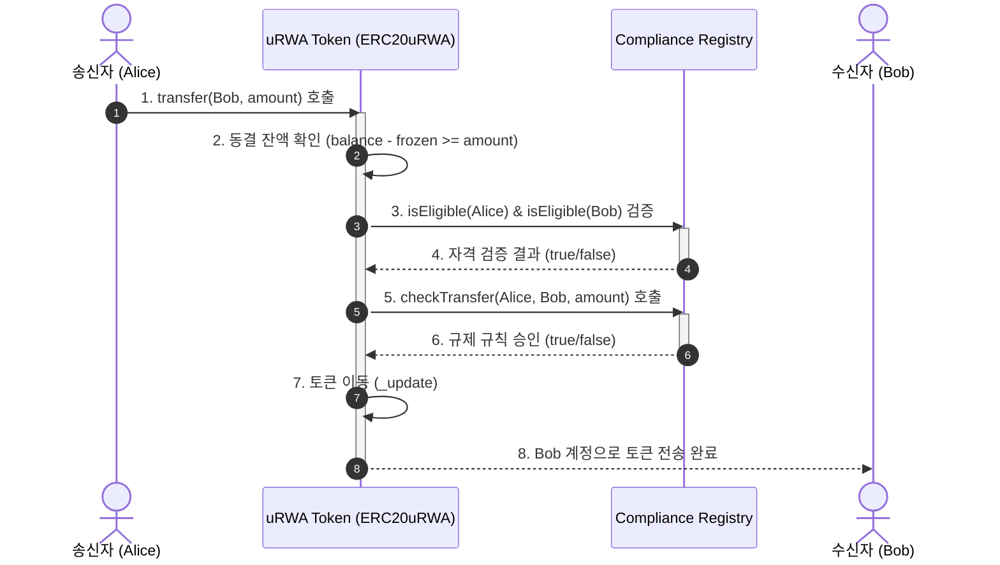
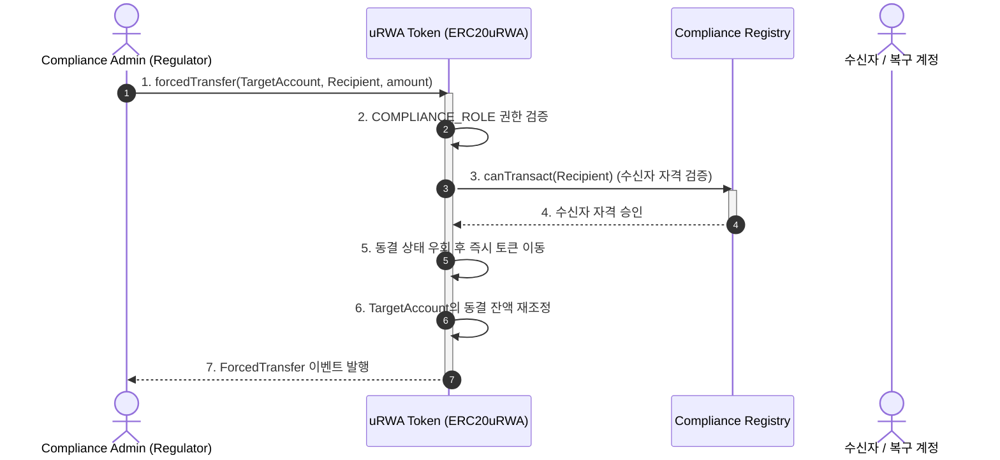

# EIP-7943 (uRWA - Universal Real World Asset) Sandbox Study Project

This repository is a test and study project for **EIP-7943 (uRWA - Universal Real-World Asset Interface)**, implementing a standard interface for permissioned, regulatory-compliant assets (e.g., securities, real estate, commodities) on EVM-compatible blockchains. 

---

## Architecture & Flow Diagrams

### EIP-7943 Architecture


---

### Core Flowcharts

#### 1. Compliance Transfer Flow (일반 전송 및 규제 검증 흐름)



#### 2. Forced Transfer Flow (강제 전송 / 법적 집행 흐름)



---


## Project Structure

```text
EIP-7943/
├── contracts/
│   ├── interfaces/
│   │   ├── IERC7943Fungible.sol       # EIP-7943 Fungible (ERC-20) Interface
│   │   ├── IERC7943NonFungible.sol    # EIP-7943 Non-Fungible (ERC-721) Interface
│   │   └── IERC7943MultiToken.sol     # EIP-7943 Multi-Token (ERC-1155) Interface
│   ├── ERC20uRWA.sol                  # Fungible uRWA Token implementation (ERC-20)
│   ├── ERC721uRWA.sol                 # Non-Fungible uRWA Token implementation (ERC-721)
│   ├── ERC1155uRWA.sol                # Multi-Token uRWA Token implementation (ERC-1155)
│   └── ComplianceRegistry.sol         # Mock KYC registry for rules & whitelist gating
├── test/
│   └── uRWA.test.js                   # Comprehensive Hardhat tests for uRWA behaviors
├── hardhat.config.js                  # Solidity compiler & Cancun EVM version setup
├── package.json
└── README.md
```

---

## Quick Start

### 1. Install Dependencies
Install all required node packages and OpenZeppelin libraries:

```bash
npm install
```

### 2. Compile Contracts
Compile all Solidity contracts. The project uses Solidity version `0.8.24` and targets `cancun` to support the `mcopy` EVM instruction used in OpenZeppelin Contracts v5.

```bash
npm run compile
```

### 3. Run Tests
Execute the 17 integration tests verifying compliance rules, freezing mechanics, forced transfers, and ERC-165 support:

```bash
npm test
```

---

## Key Features (EIP-7943 Primitives)

1. **User Eligibility Control (Gating & Whitelisting)**
   - `canTransact(address)`: Checks if an account is eligible to hold or interact with tokens (e.g., has passed KYC/AML checks).
   - `canTransfer(address, address, uint256)`: Pre-flight function to check whether a transfer between two addresses is permitted under current regulatory rules.

2. **Asset Freezing (Operational Controls)**
   - `setFrozenTokens(address, uint256)`: Freezes a specific amount of tokens for an account.
   - `getFrozenTokens(address)`: Returns the amount of frozen tokens for an account.
   - The token holder is only permitted to transfer their **unfrozen balance** (`balanceOf(user) - getFrozenTokens(user)`).

3. **Forced Transfer (Law Enforcement & Recovery)**
   - `forcedTransfer(address, address, uint256)`: Allows an authorized entity (e.g., a regulator or compliance officer) to move assets unilaterally without the token holder's signature. This is used for lost key recovery, compliance audits, or court-ordered asset seizures. Forced transfers bypass frozen checks but still check the destination's eligibility.

4. **ERC-165 Introspection**
   - Implements `supportsInterface` so that external routers, bridges, and custodians can dynamically inspect which uRWA interface variant (Fungible, NonFungible, MultiToken) is implemented.
