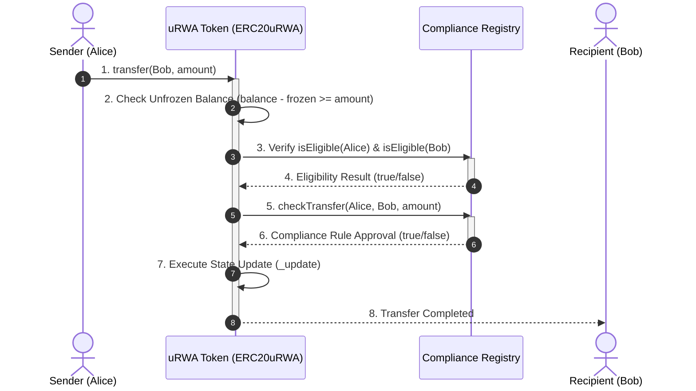
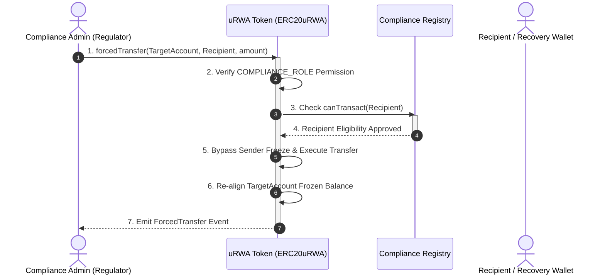
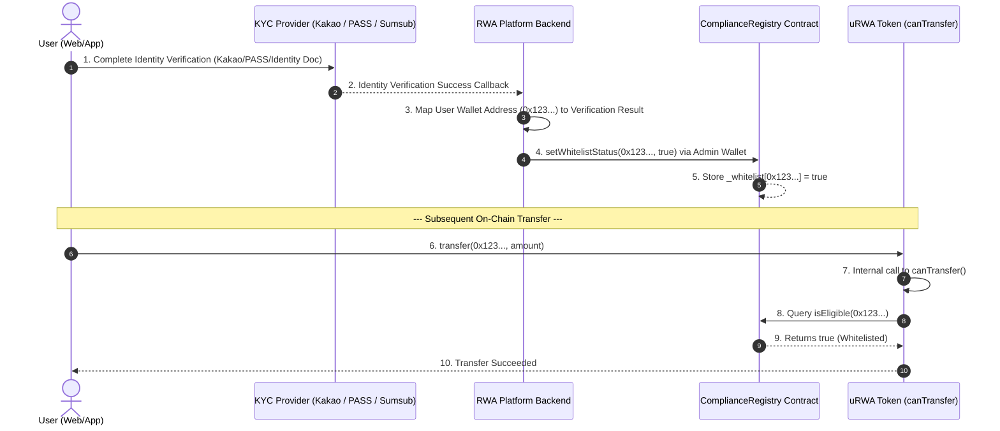

# EIP-7943 (uRWA - Universal Real World Asset) Sandbox Study Project

This repository is a comprehensive test, study, and implementation project for **EIP-7943 (uRWA - Universal Real-World Asset Interface)**. It defines a standardized EVM interface for regulatory-compliant, permissioned tokenized assets (e.g., real estate, securities, commodities, tokenized funds).

---

## 📌 Background & Core Philosophy: RWA vs. Standard Crypto

### "Code is Law" vs. "Law is Law"
* **Standard Crypto (ERC-20, ERC-721)**: Built around permissionless, pseudonymous ownership. Once a transaction is signed, it is final ("Code is Law").
* **Real-World Assets (EIP-7943 / uRWA)**: Real-world assets are bound by legal jurisdictions and securities regulations ("Law is Law"). Tokenized securities require strict compliance controls:
  1. **KYC/AML Verification**: Tokens can only be held by verified individuals/entities.
  2. **Asset Freezing**: Legal encumbrances, court-ordered freezes, or collateral locks.
  3. **Forced Transfers**: Court-ordered asset seizures, lost private key recovery, or estate inheritance execution.

---

## 🏗️ Architecture & System Design


### Core Sequence Diagrams

#### 1. Compliance Transfer Flow


#### 2. Forced Transfer Flow (Legal Enforcement)


#### 3. Off-Chain KYC ↔ On-Chain Compliance Bridge


---

## 🚀 Live Sepolia Testnet Deployment

The project contracts have been deployed and verified on the Ethereum Sepolia Testnet.

| Contract Name | Contract Type | Sepolia Address | Etherscan Link |
| :--- | :--- | :--- | :--- |
| **ComplianceRegistry** | Registry & Rules Engine | `0x0e5C7df25b4F7Ddc8F7E73E95BFD052Be564EF10` | [View on Etherscan](https://sepolia.etherscan.io/address/0x0e5C7df25b4F7Ddc8F7E73E95BFD052Be564EF10) |
| **ERC20uRWA** | Fungible RWA Token | `0xD9b2F259d04CD0ea18c36791806054F375fDCe9f` | [View on Etherscan](https://sepolia.etherscan.io/address/0xD9b2F259d04CD0ea18c36791806054F375fDCe9f) |
| **ERC721uRWA** | Non-Fungible RWA Asset (NFT) | `0x5804C129Cc7A5D841429fA1eeB720b7B4Ee290cC` | [View on Etherscan](https://sepolia.etherscan.io/address/0x5804C129Cc7A5D841429fA1eeB720b7B4Ee290cC) |
| **ERC1155uRWA** | Multi-Token RWA Asset | `0x7E173CEa8B386ab82c153d82e7fB3AF44B37Ab56` | [View on Etherscan](https://sepolia.etherscan.io/address/0x7E173CEa8B386ab82c153d82e7fB3AF44B37Ab56) |

---

## 🛠️ Project Structure & Scripts

```text
EIP-7943/
├── contracts/
│   ├── interfaces/
│   │   ├── IERC7943Fungible.sol       # EIP-7943 Fungible (ERC-20) Interface
│   │   ├── IERC7943NonFungible.sol    # EIP-7943 Non-Fungible (ERC-721) Interface
│   │   └── IERC7943MultiToken.sol     # EIP-7943 Multi-Token (ERC-1155) Interface
│   ├── ERC20uRWA.sol                  # Fungible uRWA Token implementation (ERC-20)
│   ├── ERC721uRWA.sol                 # Non-Fungible uRWA Token implementation (ERC-721)
│   ├── ERC1155uRWA.sol                # Multi-Token uRWA Token implementation (ERC-1155)
│   └── ComplianceRegistry.sol         # KYC registry for whitelist & jurisdiction rules
├── scripts/
│   ├── create-wallet.js               # Auto-generate dev Web3 wallet & update .env
│   ├── deploy.js                      # Deployment script for all contracts
│   ├── test-erc165.js                 # IERC165 interface introspection test
│   └── test-eip7943-features.js       # Live Sepolia EIP-7943 feature scenario test
├── test/
│   └── uRWA.test.js                   # 17 Hardhat unit tests for local EVM
├── hardhat.config.js                  # Solidity compiler (0.8.24, Cancun EVM)
├── package.json
└── README.md
```

---

## 🚦 Quick Start & Execution Commands

### 1. Install Dependencies
```bash
npm install
```

### 2. Compile Contracts
```bash
npm run compile
```

### 3. Run Local Unit Tests (17/17 Passed)
```bash
npm test
```

### 4. Developer Wallet Setup (No MetaMask Required)
Automatically generate a new developer wallet and save its private key to `.env`:
```bash
npm run create-wallet
```

### 5. Deploy to Sepolia Testnet
```bash
npm run deploy:sepolia
```

### 6. Run On-Chain EIP-7943 Feature Scenario Tests
Test KYC minting restrictions, asset freezing, forced transfers, and jurisdiction blocks live on Sepolia:
```bash
npm run test-rwa
```

---

## 🔬 EIP-7943 Primitives Summary

1. **User Eligibility Control (Whitelisting & Gating)**
   - `canTransact(address)`: Returns `true` if an account is eligible to hold tokens (KYC/AML verified).
   - `canTransfer(address from, address to, uint256 amount)`: Pre-flight check to verify if a transfer is permitted under compliance rules.

2. **Asset Freezing (Operational & Encumbrance Lockup)**
   - `setFrozenTokens(address account, uint256 amount)`: Locks a specific amount of tokens for an account.
   - `getFrozenTokens(address account)`: Returns the amount of frozen tokens.
   - Users can only transfer their **unfrozen balance** (`balanceOf(user) - getFrozenTokens(user)`).

3. **Forced Transfer (Regulatory Enforcement & Key Recovery)**
   - `forcedTransfer(address from, address to, uint256 amount)`: Allows an authorized entity (`COMPLIANCE_ROLE`) to move tokens without sender signature. Used for lost key recovery, court orders, or asset seizures.

4. **ERC-165 Interface Introspection**
   - Implements `supportsInterface(bytes4)` to allow external protocols, custody platforms, and bridges to dynamically detect EIP-7943 compliance (`IERC165` ID `0x01ffc9a7` & `IERC7943Fungible` ID `0x29388973`).
